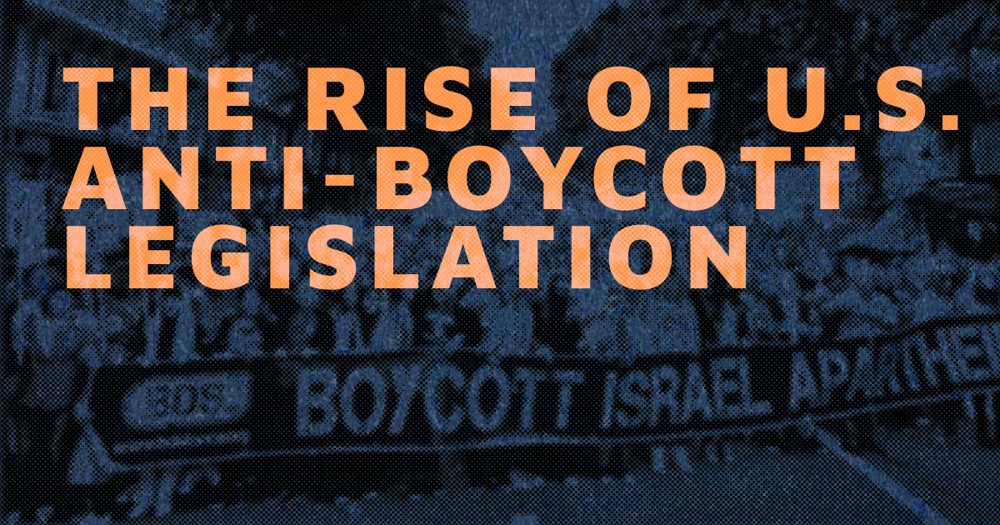

# The Rise of U.S. Anti-Boycott Legislation

This is a web-based story created for [Visualizing Palestine](http://visualizingpalestine.org) based on their infographic [The Rise of U.S. Anti-Boycott Legislation](https://visualizingpalestine.org/visuals/anti-boycott-laws). It was created with [Vue](http://visualizingpalestine.org/), [Vite](https://vitejs.dev), and [scrollama](https://github.com/russellsamora/scrollama).



## Project Setup

```sh
npm install
```

### Generate optimized images shown above-the-fold

```sh
npm run images
```

### Compile and Hot-Reload for Development

```sh
npm run dev
```

### Type-Check, Compile and Minify for Production

```sh
npm run build
```

### Lint with [ESLint](https://eslint.org/)

```sh
npm run lint
```
